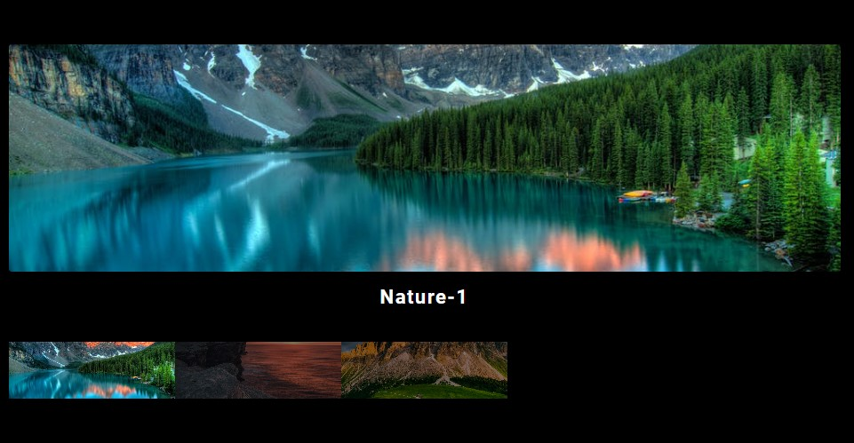

## Gallery OOP !  📸 🎥 🎞️
 

## Gallery, um aplicação simples, quem tem como objetivo mostrar fotos em forma de galeria com o conceito OOP. 💻 📚
 

## Projeto 🥰

### [Gallery OOP](https://alisson-aguiars2k.github.io/gallery-oop/) 🔗

## Tecnologias que utilizei para o projeto ;  

 
    
    
    

